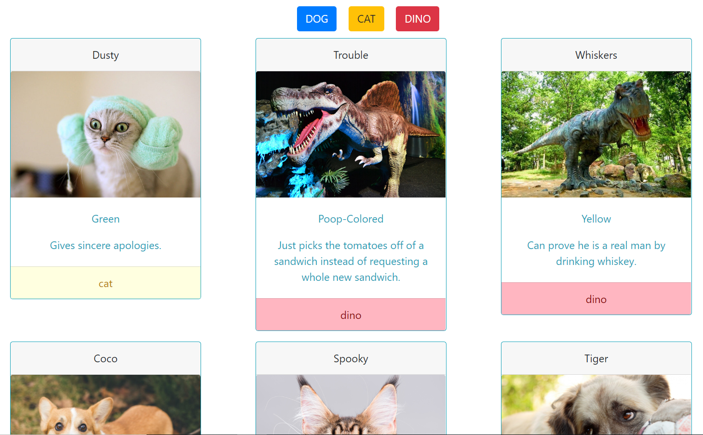

# adoption-site

## Purpose

The purpose of this project was to work with JSON data and JavaScript modules. In the project, I parsed the JSON, passed it into an array, printed cards, created sorting functionality, and created reset of sorting functionality. This project was mainly styles using Bootstrap. Styling was minimal as the functionality of the project was the main focus.

## To View

1. Clone repository to local machine.
1. Using http-server (`$ npm install http-server`) feed project to the port 8888 (`-p 8888`)
1. open localhost:8888 in your browsers address bar
